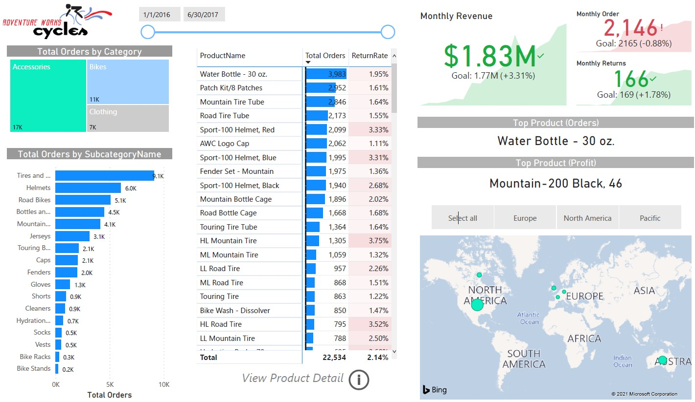
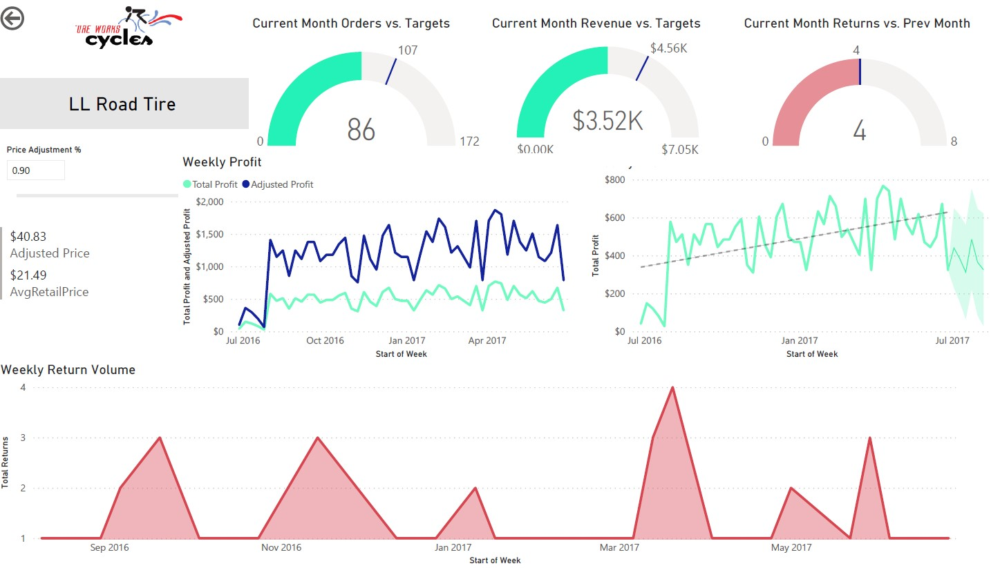
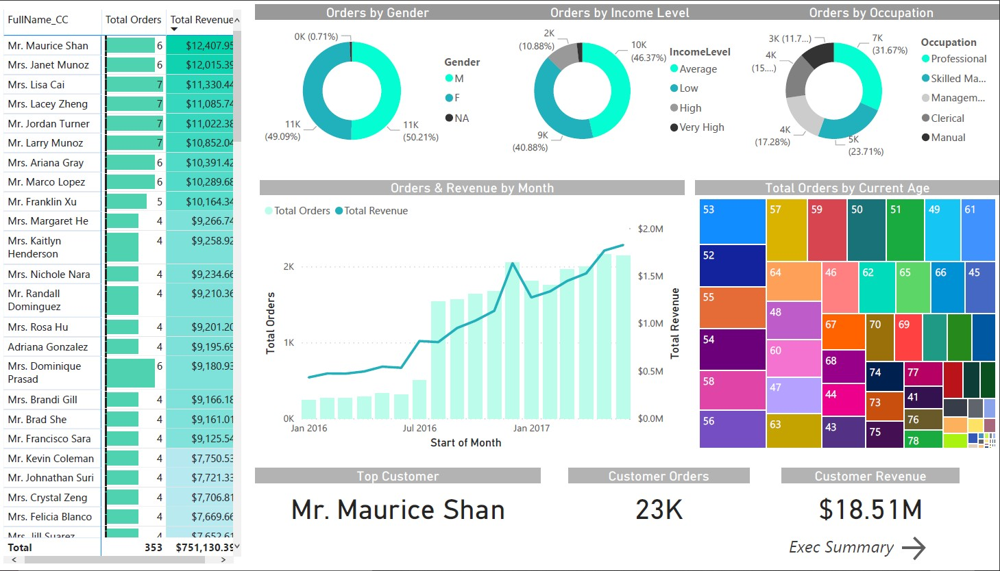

# Adventure Works Dashboard
Power Bi personal project from an online Udemy course. 
## The Problem
The project consisted of designing and deliver a professional-quality, end-to-end business intelligence solution, armed only with Power BI and a handful of raw csv files.
## The Client
Adventure Works is a global manufacturer of sport articles.
## The Report
The dashboard will allow them to visualize multiple relationships between categories and metrics. From clients to sales, orders, territory, returns, revenue, profit, among others.
### From Data Modeling to Visualization 
<ol> 
<li> Connect & Transform the Raw Data </li>
<li> Build a Relational Data Model </li>
<li> Design the Interactive Power BI Reports </li>
</ol>
## Insights
The report is divided in 3 pages.   
<ul>
<li> Exec Summary </li>   Comprehensive view where the client can see the relation of each product, by category, territory, revenue and returns. One of the most valuable features of this view is being able to filter certain periods of time and analyze whether Adventure Works reached their goals for Revenue, Orders and Returns.
</img>
<li> Product Detail </li>   In depth look of each product where the client can see a forecast for the next 6 weeks. A special feature of this page is the 'Price Adjustment Slicer %' where the client can compare between a hypothetical adjusted price and the retail price. This way the client can see at what point in their price they will start losing profit.
</img>
<li> Client Detail </li>   Detailed look into the demographics of the client base.
</img>
</ul>